<p align="center">
  
</p>

<p align="center">
  <a href="https://yash-kataria-olive.vercel.app"><strong>Portfolio ↗</strong></a>
  &nbsp; · &nbsp;
  <a href="https://www.linkedin.com/in/yash-kataria-371473296/"><strong>LinkedIn ↗</strong></a>
  &nbsp; · &nbsp;
  <a href="mailto:Yashkataria789@gmail.com"><strong>Let’s build something ↗</strong></a>
</p>

## `$ whoami`

I’m **Yash**, a computer engineering student in **Hong Kong**. I like turning ML/AI ideas into usable software, digging into data, and making the systems behind it all more reliable.

```yaml
focus:     [ML / AI, backend systems, data tools]
learning:  [neural networks, C++, DAX]
offline:   football
mode:      learn → build → test → repeat
```

## `$ ls ./featured-projects`

<a href="https://github.com/Yash789k/python-dependency-upgrade-evaluator">
  
</a>

<a href="https://github.com/Yash789k/ML-TradeEngine">
  
</a>

<a href="https://github.com/Yash789k/tariff-mapper">
  
</a>

<details>
<summary><strong>Open the project directory</strong></summary>

| Project | What you’ll find |
| :--- | :--- |
| [PatchWatch / EvalLab](https://github.com/Yash789k/python-dependency-upgrade-evaluator) | Constrained Python dependency migrations, Docker checks, evaluation fixtures, and a portable evidence viewer. [Release downloads →](https://github.com/Yash789k/python-dependency-upgrade-evaluator/releases) |
| [ML Trade Engine](https://github.com/Yash789k/ML-TradeEngine) | A quantitative research project combining ML ensembles, backtesting, and risk analysis. |
| [TariffMapper](https://github.com/Yash789k/tariff-mapper) | An AI-assisted research tool for mapping customs classifications between China and Indonesia. |
| [Market Operations Lab](https://github.com/Yash789k/market-operations-lab) | An exploration of the path from market data to validated records, positions, risk, and reconciliation. |
| [My portfolio](https://yash-kataria-olive.vercel.app) | A little more about me and what I’m building. |

</details>

## `$ cat toolbox.txt`



## `$ github --public-only`



<details>
<summary><strong>Recently updated projects</strong></summary>

<a href="https://github.com/Yash789k?tab=repositories&amp;sort=updated">
  
</a>

The visuals use public GitHub metadata. Language counts exclude forks, empty repositories, and this profile repository. The refresh date appears on the card.

</details>

## `$ play contribution-snake`

My contribution graph, with a little more movement.

<picture>
  <source media="(prefers-color-scheme: dark)" srcset="./assets/contribution-snake-dark.svg" />
  
</picture>

<sub>Generated from GitHub’s contribution calendar with <a href="https://github.com/Platane/snk">Platane/snk</a>. Refreshed daily with GitHub Actions.</sub>

---

<p align="center">
  <strong>Interesting problem? Let’s compare notes.</strong><br />
  <a href="mailto:Yashkataria789@gmail.com">Email</a> · <a href="https://www.linkedin.com/in/yash-kataria-371473296/">LinkedIn</a> · <a href="https://yash-kataria-olive.vercel.app">Portfolio</a>
</p>

<details>
<summary>Behind the terminal</summary>

The header, project cards, and statistics visuals live in this repository. The header respects reduced-motion preferences. No visitor counter, paid service, external stats-image server, or personal access token is needed for the refresh workflow. [Maintenance notes](./docs/PROFILE.md).

</details>
